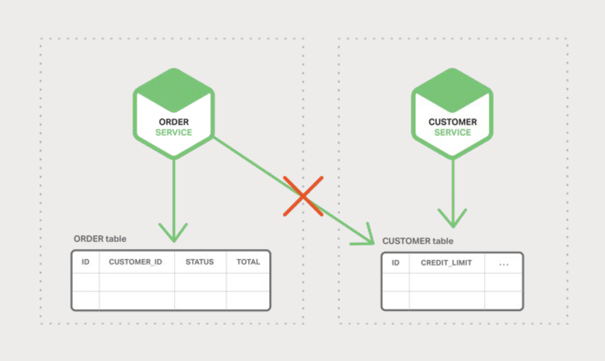
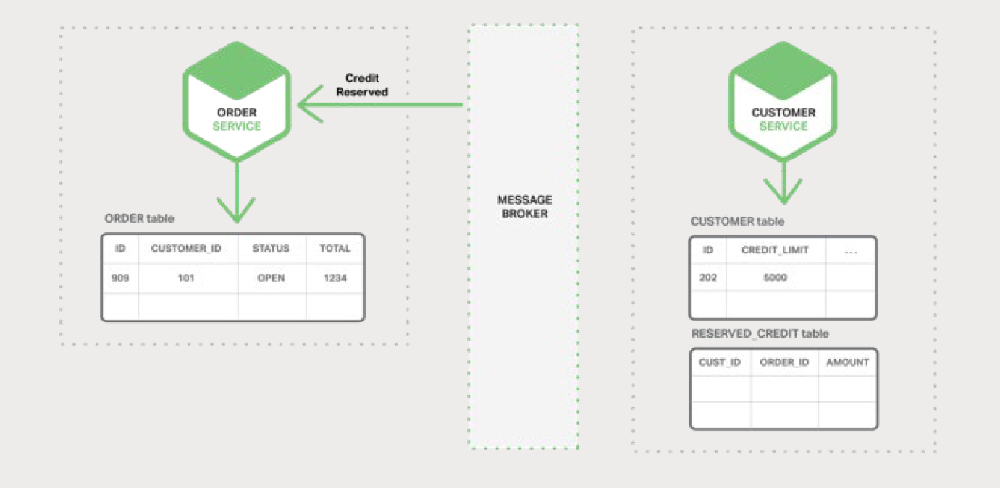
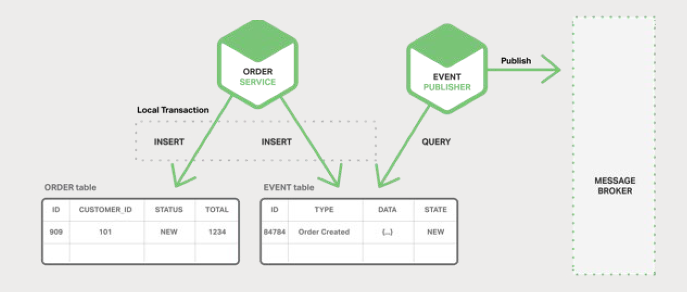
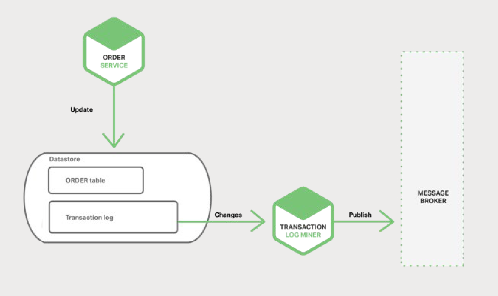
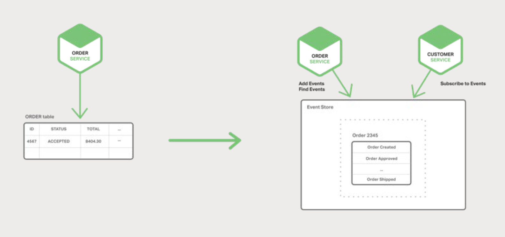

# 5、事件驱动数据管理
本书主要介绍如何使用微服务构建应用程序，这是本书的第五章。[第一章](1-introduction-to-microservices.md)介绍了微服务架构模式，讨论了使用微服务的优点与缺点。[第二](2-using-an-api-gateway.md)和[第三章](3-inter-process-communication.md)描述了微服务架构内通信方式的对比。第四章探讨了与服务发现相关的内容。在本章中，我们稍微做了点调整，研究微服务架构中出现的分布式数据管理问题。

## 5.1、微服务和分布式数据管理问题
单体应用程序通常具有一个单一的关系型数据库。使用关系型数据库的一个主要优点是您的应用程序可以使用 [ACID 事务](https://en.wikipedia.org/wiki/ACID)，这些事务提供了以下重要保障：

- **原子性（Atomicity）** — 所作出的改变是原子操作，不可分割
- **一致性（Consistency）** — 数据库的状态始终保持一致
- **隔离性（Isolation）** — 即使事务并发执行，但他们看起来更像是串行执行
- **永久性（Durable）** — 一旦事务提交，它将不可撤销

因此，您的应用程序可以很容易地开始事务、更改（插入、更新和删除）多个行，并提交事务。

使用关系数据库的另一大好处是它提供了 SQL，这是一种丰富、声明式和标准化的查询语言。您可以轻松地编写一个查询来组合来自多个表的数据，之后，RDBMS 查询计划程序将确定执行查询的最佳方式。您不必担心如何访问数据库等底层细节。因为您所有的应用程序数据都存放在同个数据库中，因此很容易查询。

很不幸的是，当我们转向微服务架构时，数据访问将变得非常复杂。这是因为每个微服务所拥有的数据[对当前微服务来说是私有的](http://microservices.io/patterns/data/database-per-service.html)，只能通过其提供的 API 进行访问。封装数据可确保微服务松耦合，独立演进。如果多个服务访问相同的数据，模式（schema）更新需要对所有服务进行耗时、协调的更新。

更糟糕的是，不同的微服务经常使用不同类型的数据库。现代应用程序存储和处理着各种数据，而关系型数据库并不总是最佳选择。在某些场景，特定的 NoSQL 数据库可能具有更方便的数据模型，提供了更好的性能和可扩展性。例如，存储和查询文本的服务使用文本搜索引擎（如 Elasticsearch）是合理的。类似地，存储社交图数据的服务应该可以使用图数据库，例如 Neo4j。因此，基于微服务的应用程序通常混合使用 SQL 和 NoSQL 数据库，即所谓的[混合持久化](http://martinfowler.com/bliki/PolyglotPersistence.html)（polyglot persistence）方式。

一个分区的数据存储混合持久化架构具有许多优点，包括了松耦合的服务以及更好的性能与可扩展性。然而，它也引入了一些分布式数据管理方面的挑战。

第一个挑战是如何实现维护多个服务之间的业务事务一致性。要了解此问题，让我们先来看一个在线 B2B 商店的示例。Customer Service （顾客服务）维护客户相关的信息，包括信用额度。Order Service （订单）负责管理订单，并且必须验证新订单，不得超过客户的信用额度。在此应用程序的单体版本中，Order Service 可以简单地使用 ACID 交易来检查可用信用额度并创建订单。

相比之下，在微服务架构中，ORDER （订单）和 CUSTOMER （顾客）表对其各自的服务都是私有的，如图 5-1 所示：

Order Service 无法直接访问 CUSTOMER 表。它只能使用客户服务提供的 API。订单服务可能使用了[分布式事务](https://en.wikipedia.org/wiki/Two-phase_commit_protocol)，也称为两阶段提交（2PC）。然而，2PC 在现代应用中通常是不可行的。[CAP 定理](https://en.wikipedia.org/wiki/CAP_theorem)要求您在可用性与 ACID 式一致性之间做出选择，可用性通常是更好的选择。此外，许多现代技术，如大多数 NoSQL 数据库，都不支持 2PC。维护服务和数据库之间的数据一致性至关重要，因此我们需要另一套解决方案。

第二个挑战是如何实现从多个服务中检索数据。例如，我们假设应用程序需要显示一个顾客和他最近的订单。如果 Order Service 提供了用于检索客户订单的 API，那么您可以使用应用程序端连接以检索数据。应用程序从 Customer Service 中检索客户，并从 Order Service 中检索客户的订单。但是，假设 Order Service 仅支持通过主键查找订单（也许它使用了仅支持基于主键检索的 NoSQL 数据库）。在这种情况下，没有有效的方法来检索所需的数据。

## 5.2、事件驱动架构
许多应用使用了[事件驱动架构](https://martinfowler.com/eaaDev/EventNarrative.html)作为解决方案。在此架构中，微服务在发生某些重要事件时发布一个事件，例如更新业务实体时。其他微服务订阅了这些事件，当微服务接收到一个事件时，它可以更新自己的业务实体，这可能导致更多的事件被发布。

您可以使用事件实现跨多服务的业务事务。一个事务由一系列的步骤组成。每个步骤包括了微服务更新业务实体和发布事件所触发的下一步骤。下图依次展示了如何在创建订单时使用事件驱动方法来检查可用信用额度。

微服务通过 Message Broker （消息代理）进行交换事件：

- Order Service （订单服务）创建一个状态为 NEW 的订单，并发布一个 Order
Created （订单创建）事件。

- Customer Service （客户服务）消费了 Order Created 事件，为订单预留信用额度，并发布 Credit Reserved 事件。

- Order Service 消费了 Credit Reserved （信用预留）事件并将订单的状态更改为 OPEN。

更复杂的场景可能会涉及额外的步骤，例如在检查客户信用的同时保留库存。

假设（a）每个服务原子地更新数据库并发布事件，稍后再更新，（b）Message Broker 保证事件至少被传送一次，您可以实现跨多服务的业务事务。需要注意的是，这些并不是 ACID 事务。它们只提供了更弱的保证，如[最终一致性](https://en.wikipedia.org/wiki/Eventual_consistency)。该事务模型称为 [BASE 模型](http://queue.acm.org/detail.cfm?id=1394128)。

您还可以使用事件来维护多个微服务预先加入所拥有的数据的物化视图（materialized view）。维护视图的服务订阅了相关事件并更新视图。图 5-5 展示了 Customer Order View Updater Service （客户订单视图更新服务）根据 Customer
Service 和 Order Service 发布的事件更新 Customer Order View （客户订单服务）。

当 Customer Order View Updater Service 接收到 Customer 或 Order 事件时，它会更新 Customer Order View 数据存储。您可以使用如 MongoDB 之类的文档数据库实现 Customer Order
View，并为每个 Customer 存储一个文档。Customer Order View Query Service （客户订单视图查询服务）通过查询 Customer Order View 数据存储来处理获取一位客户和最近的订单的请求。

事件驱动的架构有几个优点与缺点。它能够实现跨越多服务并提供最终一致性事务。另一个好处是它还使得应用程序能够维护[物化视图](https://en.wikipedia.org/wiki/Materialized_view)。

一个缺点是其编程模型比使用 ACID 事务更加复杂。通常，您必须实现补偿事务以从应用程序级别的故障中恢复。例如，如果信用检查失败，您必须取消订单。此外，应用程序必须处理不一致的数据。因为未提交的事务所做的更改是可见的。如果从未更新的物化视图中读取，应用程序依然可以看到不一致性。另一个缺点是订阅者必须要检测和忽略重复的事件。

## 5.3、实现原子性
在事件驱动架构中，同样存在着原子更新数据库和发布事件相关问题。例如，Order Service 必须在 ORDER 表中插入一行数据，并发布 Order Created 事件。这两个操作必须原子完成。如果在更新数据库后但在发布事件之前发生服务崩溃，系统将出现不一致性。确保原子性的标准方法是使用涉及到数据库和 Message Broker 的分布式事务。然而，由于上述原因，如 CAP 定理，这并不是我们想做的。

## 5.4、使用本地事务发布事件
实现原子性的一种方式是应用程序使用[仅涉及本地事务的多步骤过程](http://queue.acm.org/detail.cfm?id=1394128)来发布事件。诀窍在于存储业务实体状态的数据库中有一个用作消息队列的 EVENT 表。应用程序开启一个（本地）数据库事务，更新业务实体状态，将事件插入到 EVENT 表中，之后提交事务。一个单独的应用程序线程或进程查询 EVENT 表，将事件发布到 Message Broker，然后使用本地事务将事件标记为已发布。设计如图 5-6 所示。

Order Service 将一行记录插入到 ORDER 表中，并将一个 Order Created 事件插入到 EVENT 表中。Event Publisher（事件发布者）线程或进程从 EVENT 表中查询未发布的事件，之后发布这些事件，最后更新 EVENT 表以将事件标记为已发布。

这种方法有好有坏。好处是它保证了被发布的事件每次更新都不依赖于 2PC。此外，应用程序发布业务级事件，这些事件可以消除推断的需要。这种方法的缺点是它很容易出错，因为开发人员必须要记得发布事件。这种方法的局限性在于，由于其有限的事务和查询功能，在使用某些 NoSQL 数据库时，实现起来将是一大挑战。

该方法通过让应用程序使用本地事务更新状态和发布事件来消除对 2PC 的依赖。现在我们来看一下通过应用程序简单地更新状态来实现原子性的方法。

## 5.5、挖掘数据库事务日志
不依靠 2PC 来实现原子性的另一种方式是使用线程或进程发布事件，该线程或进程对数据库的事务或者提交日志进行挖掘。当应用程序更新数据库时，更改信息被记录到数据库的事务日志中。Transaction Log Miner 线程或进程读取事务日志并向 Message Broker 发布事件。设计如图 5-7 所示。

使用这种方法的一个示例是 LinkedIn Databus 开源项目。Databus 挖掘 Oracle 事务日志并发布与更改相对应的事件。LinkedIn 使用 Databus 保持与记录系统一致的各种派生数据存储。

另一个例子是 AWS DynamoDB 中的流机制，它是一个托管的 NoSQL 数据库。DynamoDB 流包含了在过去 24 小时内对 DynamoDB 表中的项进行的更改（创建、更新和删除操作），其按时间顺序排列。应用程序可以从流中读取这些更改，比如，将其作为事件发布。

事务日志挖掘有各种好处与坏处。一个好处是它能保证被发布的事件每次更新都不依赖于 2PC。事务日志挖掘还可以通过将事件发布与应用程序的业务逻辑分离来简化应用程序。一个主要的缺点是事务日志的格式对于每个数据库来说都是专有的，甚至在数据库版本之间格式就发生了改变。而且，记录于事务日志中的低级别更新可能难以对高级业务事件进行逆向工程。

事务日志挖掘消除了应用程序在做一件事时对 2PC 的依赖：更新数据库。现在我们来看看另一种可以消除更新并仅依赖于事件的不同方式。

## 5.6、使用事件溯源
[事件溯源](https://github.com/cer/event-sourcing-examples/wiki/WhyEventSourcing)通过使用完全不同的、不间断的方式来持久化业务实体，实现无 2PC 原子性。应用程序不存储实体的当前状态，而是存储一系列状态改变事件。该应用程序通过回放事件来重建实体的当前状态。无论业务实体的状态何时发生变化，其都会将新事件追加到事件列表中。由于保存事件是一个单一操作，因此具有原子性。

要了解事件溯源的工作原理，以 Order（订单）实体为例。在传统方式中，每个订单都与 ORDER 表中的某行记录相映射，也可以映射到例如 ORDER_LINE_ITEM 表中的记录。

但当使用事件溯源时，Order Service 将以状态更改事件的形式存储 Order：Created（创建）、Approved（批准）、Shipped（发货）、Cancelled（取消）。每个事件包含足够的数据来重建 Order 的状态。

事件被持久化在事件存储中，事件存储是一个事件数据库。该存储有一个用于添加和检索实体事件的 API。事件存储还与我们之前描述的架构中的 Message Broker 类似。它提供了一个 API，使得服务能够订阅事件。事件存储向所有感兴趣的订阅者派发所有事件。可以说事件存储是事件驱动微服务架构的支柱。

事件溯源有几个好处。它解决了实现事件驱动架构的关键问题之一，可以在状态发生变化时可靠地发布事件。因此，它解决了微服务架构中的数据一致性问题。此外，由于它持久化的是事件，而不是领域对象，所以它主要避免了[对象关系阻抗失配问题](https://en.wikipedia.org/wiki/Object-relational_impedance_mismatch)。事件溯源还提供了对业务实体所做更改的 100％ 可靠的审计日志，可以实现在任何时间点对实体进行时间查询以确定状态。事件溯源的另一个主要好处是您的业务逻辑包括松耦合的交换事件业务实体，这使得从单体应用程序迁移到微服务架构将变得更加容易。

事件溯源同样有缺点。这是一种不同而陌生的编程风格，因此存在学习曲线。事件存储仅支持通过主键查找业务实体。您必须使用[命令查询责任分离](https://github.com/cer/event-sourcing-examples/wiki)（CQRS）来实现查询。因此，应用程序必须处理最终一致的数据。

## 5.7、总结
在微服务架构中，每个微服务都有自己私有的数据存储。不同的微服务可能会使用不同的 SQL 或者 NoSQL 数据库。虽然这种数据库架构具有明显的优势，但它创造了一些分布式数据管理挑战。第一个挑战是如何实现维护多个服务间的业务事务一致性。第二个挑战是如何实现从多个服务中检索数据。

大部分应用使用的解决方案是事件驱动架构。实现事件驱动架构的一个挑战是如何以原子的方式更新状态以及如何发布事件。有几种方法可以实现这点，包括了将数据库作为消息队列、事务日志挖掘和事件溯源。

## 微服务实战：NGINX 与存储优化

by Floyd Smith

基于微服务的存储方法涉及大数量和各种数据存储，访问和更新数据将变得更加复杂，DevOps 在维护数据一致性方面面临着更大的挑战。NGINX 为这种数据管理提供了重要支持，主要有三个方面：

1. **数据缓存与微缓存（microcaching）**

    使用 NGINX 缓存静态文件和微缓存应用程序生成的内容可减轻应用程序的负载、提高性能并减少问题的发生。
2. **数据存储的灵活性与可扩展性**

    一旦将 NGINX 作为反向代理服务器，您的应用程序在创建、调整大小、运行和调整数据存储服务器的大小时可获得很大的灵活性，以满足不断变化的需求 - 每个服务都拥有自己的数据存储是很重要的。
3. **服务监控与管理，包括数据服务**

    随着数据服务器数量的增加，支持复杂操作和具有监控和管理工具显得非常重要。[NGINX Plus](https://www.nginx.com/products/) 内置了这些工具和应用程序性能管理[合作伙伴](https://www.nginx.com/partners/)的接口，如 Data Dog、Dynatrace 和 New Relic。

微服务相关的数据管理示例可在 NGINX [微服务参考架构](https://www.nginx.com/blog/introducing-the-nginx-microservices-reference-architecture/)的三大模型中找到，其为您设计决策和实施提供了起点。