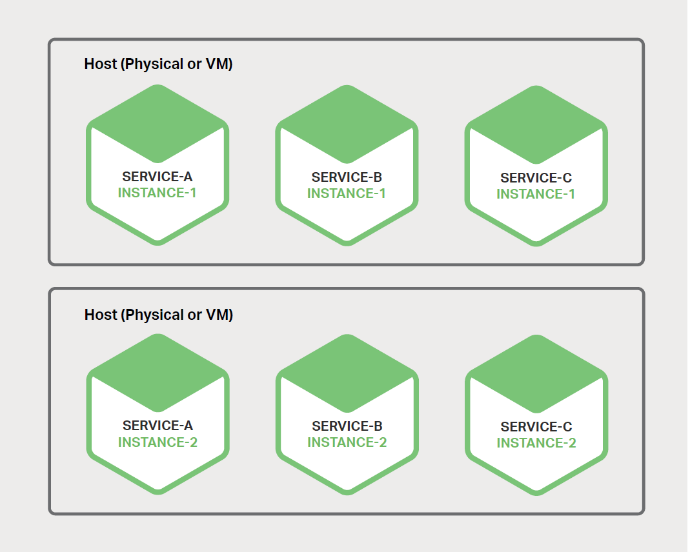
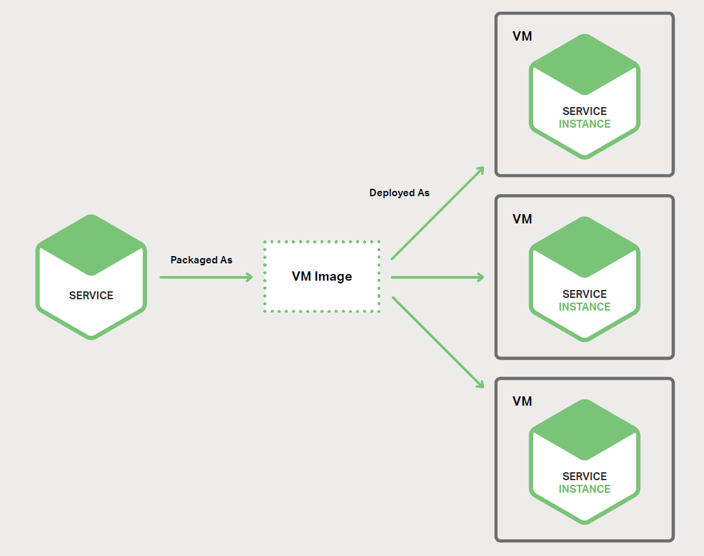
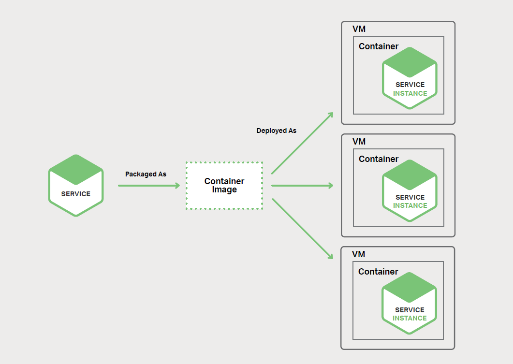

# 6、选择部署策略
本书内容主要关于如何使用微服务构建应用程序，这是本书的第六章。第一章介绍了[微服务架构模式](http://microservices.io/patterns/microservices.html)，讨论了使用微服务的优点与缺点。之后的章节讨论了微服务架构的方方面面：[使用 API ​​网关](2-using-an-api-gateway.md)、[进程间通信](3-inter-process-communication.md)、[服务发现](4-service-discovery.md)和[事件驱动数据管理](5-event-driven-data-management-for-microservices.md)。在本章中，我们将介绍部署微服务的策略。

## 6.1、动机
部署[单体应用](http://microservices.io/patterns/monolithic.html)程序意味着运行一个或多个相同副本的单个较大的应用程序。您通常会在每个服务器上配置 N 个服务器（物理或虚拟）并运行 M 个应用程序实例。单体应用程序的部署并不总是非常简单，但它比部署微服务应用程序要简单得多。

[微服务应用程序](http://microservices.io/patterns/microservices.html)由数十甚至上百个服务组成。服务以不同的语言和框架编写。每个都是一个迷你的应用程序，具有自己特定的部署、资源、扩展和监视要求。例如，您需要根据该服务的需求运行每个服务的一定数量的实例。此外，必须为每个服务实例提供相应的 CPU、内存和 I/O 资源。更具挑战性的是尽管如此复杂，部署服务也必须快速、可靠和具有成本效益。

有几种不同的微服务部署模式。我们首先看看单主机多服务实例模式。

## 6.2、单主机多服务实例模式
部署微服务的一种方式是使用[单主机多服务实例](http://microservices.io/patterns/deployment/multiple-services-per-host.html)（Multiple Service Instances per Host）模式。当使用此模式时，您可以提供一个或多个物理主机或虚拟主机，并在每个上运行多个服务实例。从多方面来讲，这是应用程序部署的传统方式。每个服务实例在一个或多个主机的标准端口上运行。主机通常被[当作宠物对待](https://www.nginx.com/blog/microservices-at-netflix-architectural-best-practices/#stateless-servers)。

图 6-1 展示了该模式的结构：

这种模式有几个变体。一个变体是每个服务实例都是一个进程或进程组。例如，您可以在 [Apache Tomcat](http://tomcat.apache.org/) 服务器上将 Java 服务实例部署为 Web 应用程序。一个 [Node.js](https://nodejs.org/) 服务实例可能包含一个父进程和一个或多个子进程。

此模式的另一个变体是在同一进程或进程组中运行多个服务实例。例如，您可以在同一个 Apache Tomcat 服务器上部署多个 Java Web 应用程序，或在同一 OSGI 容器中运行多个 OSGI 软件包。

单主机多服务实例模式有优点也有缺点。主要优点是其资源使用率相对较高。多个服务实例共享服务器及其操作系统。如果进程或组运行了多个服务实例（例如，共享相同的 Apache Tomcat 服务器和 JVM 的多个 Web 应用程序），则效率更高。

这种模式的另一个优点是部署服务实例相对较快。您只需将服务复制到主机并启动它。如果服务是使用 Java 编写的，则可以复制 JAR 或 WAR 文件。对于其他语言，例如 Node.js 或 Ruby，您可以直接复制源代码。在任一情况下，通过网络复制的字节数都是相对较小的。

另外，由于缺乏开销，通常启动一个服务是非常快的。如果该服务是自己的进程，你只需要启动它即可。如果服务是在同一容器进程或进程组中运行的几个实例之一，则可以将其动态部署到容器中或者重新启动容器。

尽管这很有吸引力，但单主机多服务实例模式有一些明显的缺点。一个主要的缺点是服务实例很少或者没有隔离，除非每个服务实例是一个单独的进程。虽然您可以准确地监视每个服务实例的资源利用率，但是您不能限制每个实例使用的资源。一个行为不当的服务实例可能会占用掉主机的所有内存或 CPU。

如果多个服务实例在同一进程中运行，那么毫无隔离可言。例如，所有实例可能共享相同的 JVM 堆。行为不当的服务实例可能会轻易地破坏在同一进程中运行的其他服务。此外，您无法监控每个服务实例使用的资源。

这种方式的另一个重要问题是部署服务的运维团队必须了解执行此操作的具体细节。服务可以用多种语言和框架编写，因此开发团队必须与运维交代许多细节。这种复杂性无疑加大了部署过程中的错误风险。

正如您所见，尽管这种方式简单，但单主机多服务实例模式确实存在一些明显的缺点。现在让我们来看看可以绕过这些问题部署微服务的其他方式。

## 6.3、每个主机一个服务实例模式
部署微服务的另一种方式是使用[每个主机一个服务实例](http://microservices.io/patterns/deployment/single-service-per-host.html)（Service Instance per Host）模式。当使用此模式时，您可以在主机上单独运行每个服务实例。这种模式有两种不同形式：每个虚拟机一个服务实例和每个容器一个服务实例模式。

### 6.3.1、每个虚拟机一个服务实例模式
当您使用[每个虚拟机一个服务实例](http://microservices.io/patterns/deployment/service-per-vm.html)模式时，将每个服务打包为一个虚拟机（VM）镜像（如 [Amazon EC2 AMI](https://aws.amazon.com/cn/ec2/)）。每个服务实例都是一个使用该 VM 镜像启动的 VM（例如，一个 EC2 实例）。

图 6-2 展示了该模式的结构：

这是 Netflix 部署其视频流服务的主要方式。Netflix 使用 [Aminator](https://github.com/Netflix/aminator) 将每个服务打包为 EC2 AMI。每个运行的服务实例都是一个 EC2 实例。

您可以使用多种工具来构建自己的虚拟机。您可以配置您的持续集成（CI）服务器（比如 [Jenkins](https://jenkins.io/index.html)）来调用 Aminator 将服务打包为一个 EC2 AMI。[Packer](https://www.packer.io/) 是自动化虚拟机镜像创建的另一个选择。与 Aminator 不同，它支持各种虚拟化技术，包括 EC2、DigitalOcean、VirtualBox 和 VMware。

[Boxfuse](https://boxfuse.com/) 公司有一个非常棒的方式来构建虚拟机镜像，其克服了我将在下面描述的虚拟机的缺点。Boxfuse 将您的 Java 应用程序打包成一个最小化的 VM 镜像。这些镜像可被快速构建、快速启动且更加安全，因为它们暴露了一个有限的攻击面。

[CloudNative](https://cloudnative.io/) 公司拥有 Bakery，这是一种用于创建 EC2 AMI 的 SaaS 产品。您可以配置您的 CI 服务器，以在微服务通过测试后调用 Bakery。之后 Bakery 将您的服务打包成一个 AMI。使用一个如 Bakery 的 SaaS 产品意味着您不必浪费宝贵的时间来设置 AMI 创建基础架构。

每个虚拟机一个服务实例模式有许多优点。VM 的主要优点是每个服务实例运行是完全隔离的。它有固定数量的 CPU 和内存，且不能从其他服务窃取资源。

将微服务部署为虚拟机的另一个优点是可以利用成熟的云基础架构。如 AWS 之类的云提供了有用的功能，例如负载平衡和自动扩展。

将服务部署为虚拟机的另一个好处是它封装了服务的实现技术。一旦服务被打包成一个虚拟机，它就成为一个黑匣子。VM 的管理 API 成为部署服务的 API。部署变得更加简单、可靠。

然而，每个虚拟机一个服务实例模式也有一些缺点。一个缺点是资源利用率较低。每个服务实例都有一整个 VM 开销，包括操作系统。此外，在一个典型的公共 IaaS 中，VM 具有固定大小，并且 VM 可能未被充分利用。

此外，公共 IaaS 中的 VM 通常是收费的，无论它们是处于繁忙还是空闲。如 AWS 之类的 IaaS 虽然提供了自动扩展功能，但[很难快速响应需求变化](http://techblog.netflix.com/2013/11/scryer-netflixs-predictive-auto-scaling.html)。因此，您经常需要过度配置 VM，从而增加部署成本。

这种方法的另一缺点是部署新版本的服务时通常很慢。由于大小原因，VM 镜像通常构建很慢。此外，VM 实例化也很慢，同样是因为它们的大小。而且，操作系统也需要一些时间来启动。但请注意，这并不普遍，因为已经存在由 Boxfuse 构建的轻量级 VM。

每个虚拟机一个服务实例模式的另一个缺点是通常您要（或组织中的其他人）对很多未划分的重担负责。除非您使用 Boxfuse 这样的工具来处理构建和管理虚拟机的开销，否则这将是您的责任。这个必要而又耗时的活动会分散您的核心业务。

接下来让我们看看另一种部署更轻量级微服务的替代方式，它也有许多与虚拟机一样的优势。

### 6.3.2、每个容器一个服务实例模式
当您使用[每个容器一个服务实例模式](http://microservices.io/patterns/deployment/service-per-container.html)（Service Instance per Container）模式时，每个服务实例都在其自己的容器中运行。容器是一个[操作系统级虚拟化机制](https://en.wikipedia.org/wiki/Operating-system-level_virtualization)。一个容器是由一个或多个运行在沙箱中的进程组成。从进程的角度来看，它们有自己的端口命名空间和根文件系统。您可以限制容器的内存和 CPU 资源。一些容器实现也具有 I/O 速率限制。容器技术的相关例子有 [Docker](https://www.docker.com/) 和 [Solaris Zones](https://en.wikipedia.org/wiki/Solaris_Containers)。

图 6-3 展示了该模式的结构：

要使用此模式，请将您的服务打包成一个容器镜像。容器镜像是由运行服务所需的应用程序和库组成的文件系统镜像。一些容器镜像由完整的 Linux 根文件系统组成。此外它更加轻便。例如，要部署一个 Java 服务，您可以构建一个包含了 Java 运行时的容器镜像，可能是一个 Apache Tomcat 服务器和编译好的 Java 应用程序。

将服务打包成一个容器镜像后，您将启动一个或多个容器。通常在每个物理或虚拟主机上运行多个容器。您可以使用集群管理工具（如 [Kubernetes](https://kubernetes.io/) 或 [Marathon](https://github.com/mesosphere/marathon)）来管理容器。集群管理工具将主机视为一个资源池。它根据容器所需的资源和每个主机上可用的资源来决定每个容器放置的位置。

每个容器一个服务实例模式模式有优点和缺点。容器的优点与虚拟机的类似。它们将服务实例彼此隔离。您可以轻松地监控每个容器所消耗的资源。此外，与 VM 一样，容器封装了服务实现技术。容器管理 API 作为管理您的服务的 API。

然而，与虚拟机不同，容器是轻量级技术。容器镜像通常可以非常快速地构建。例如，在我的笔记本电脑上，将一个 [Spring Boot](http://projects.spring.io/spring-boot/) 应用程序打包成一个 Docker 容器只需要 5 秒钟的时间。容器也可以很快地启动，因为没有繁琐的操作系统引导机制。当一个容器启动时，它所运行的就是服务。

使用容器有一些缺点。虽然容器基础架构正在快速发展走向成熟，但它并不像虚拟机的基础架构那么成熟。此外，容器不像 VM 那样安全，因为容器彼此共享了主机的 OS 内核。

容器的另一个缺点是您需要负责容器镜像管理未划分的重担。此外，除非您使用了托管容器解决方案［如 [Google Container Engine](https://cloud.google.com/container-engine/) 或 [Amazon EC2 Container Service](https://cloud.google.com/container-engine/)（ECS）］，否则您必须自己管理容器基础架构以及可能运行的 VM 基础架构。

此外，容器通常部署在一个按单个 VM 收费的基础设施上。因此，如之前所述，可能会产生超额配置 VM 的额外成本，以处理负载峰值。

有趣的是，容器和 VM 之间的区别可能会有些模糊。如之前所述，Boxfuse VM 可以很快地构建和启动。[Clear Containers](https://clearlinux.org/features/clear-containers) 项目旨在创建轻量级虚拟机。[Unikernels](https://en.wikipedia.org/wiki/Unikernel) 也正在蓬勃发展。Docker 公司于 2016 年初收购了 Unikernel 系统。

还有一个日益流行的 server-less（无服务器）部署概念，这是一种避免了“在容器中还是在虚拟机中部署服务”问题的方法。接下来我们来看看。

## 6.4、Serverless 部署
[AWS Lambda](https://aws.amazon.com/lambda/) 就是一个 serverless 部署技术示例。它支持 Java、Node.js 和 Python 服务。要部署微服务器，请将其打包成 ZIP 文件并将上传到 AWS Lambda。您还要提供元数据，其中包括了被调用来处理请求（又称为事件）的函数的名称。AWS Lambda 自动运行足够的微服务服务实例来处理请求。您只需根据每个请求所用时间和内存消耗来付费。当然，问题往往出现在细节上，您很快注意到了 AWS Lambda 的局限性。但是，作为开发人员的您或组织中的任何人都无需担心服务器、虚拟机或容器的任何方面 ，这非常有吸引力，足以令人难以置信。

Lambda 函数是无状态服务。它通常通过调用 AWS 服务来处理请求。例如，当图片上传到 S3 存储桶时Lambda 函数将被调用，可插入一条记录到 DynamoDB 图片表中，并将消息发布到 Kinesis 流以触发图片处理。 Lambda 函数还可以调用第三方 Web 服务。

有四种方法调用 Lambda 函数：

- 直接使用 Web 服务请求
- 自动响应一个 AWS 服务（如 S3、DynamoDB、Kinesis 或 Simple Email Service）生成的事件
- 通过 AWS API 网关自动处理来自应用程序客户端的 HTTP 请求
- 按照一个类似 cron 的时间表，定期执行

正如您所见，AWS Lambda 是一个便捷的微服务部署方式。基于请求的定价意味着您只需为服务实际执行的工作支付。另外，由于您不需要对 IT 基础架构负任何责任，因此可以专注于开发应用程序。

然而，其也存在一些明显的局限性。Lambda 函数不适用于部署长时间运行的服务，例如消耗第三方消息代理消息的服务。请求必须在 300 秒内完成。服务必须是无状态的，因为理论上，AWS Lambda 可能为每个请求运行一个单独的实例。他们必须使用受支持的语言之一来编写。服务也必须快速启动；否则，他们可能会因超时而终止。

## 6.5、总结
部署微服务应用程序充满着挑战。您可能有数个甚至数百个使用了各种语言和框架编写的服务。每个应用程序都是一个迷你应用程序，有自己特定的部署、资源、扩展和监视需求。有几个微服务部署模式，包括每个虚拟机一个服务实例和每个容器一个服务实例模式。部署微服务的另一个有趣的选择是 AWS Lambda，一种 serverless 方式。在本书的下一章也是最后一章中，我们将介绍如何将单体应用程序迁移到微服务架构。

## 微服务实战：使用 NGINX 在不同主机上部署微服务

by Floyd Smith

NGINX 对于各种类型的部署具有许多优势 - 无论是单体应用程序、微服务应用程序还是混合应用程序（将在下一章介绍）。使用 NGINX，您可以将情报从不同的部署环境中抽象出来并进入 NGINX。如果您使用针对不同部署环境的工具，则有许多应用程序功能以不同的方式工作，但​​如果使用 NGINX，那么在所有环境中都可以使用相同的方式进行工作。

这一特性也为 NGINX 和 NGINX Plus 带来了第二个优势：通过在多个部署环境中同时运行应用程序来扩展应用程序的能力。假设您拥有和管理着的本地服务器，但是您的应用程序使用情况正在增长，并且预计将超出这些服务器可以处理的峰值。如果你已经使用了 NGINX，您就有了一个强大的选择：扩展到云端 - 例如，[扩展到 AWS 上](https://www.nginx.com/products/nginx-plus-aws/)，而不是购买、配置和保持额外的服务器来为了防万一。也就是说，当您的本地服务器上的流量达到容量限制时，可根据需要在云中启动其他微服务实例来处理。

这只是因使用 NGINX 变得更加灵活的一个例子。维护单独的测试和部署环境、切换环境的基础设施、以及管理各种环境中的应用程序组合都变得更加现实和可实现。

[NGINX 微服务参考架构](https://www.nginx.com/blog/introducing-the-nginx-microservices-reference-architecture/)被明确设计为支持这种灵活部署，其假设在开发和部署期间使用容器技术。如果您还没尝试，可以考虑转移到容器，还有 NGINX 或 NGINX Plus，以轻松地转移到微型服务，以及面向未来的应用程序、开发和部署灵活性以及人员。