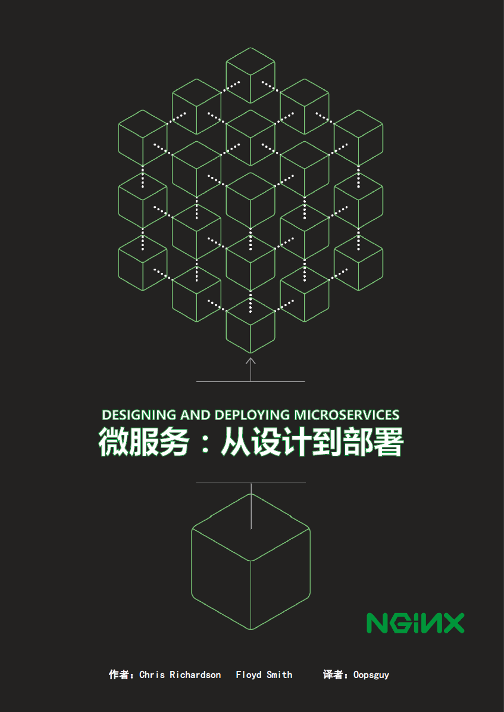

# 《微服务：从设计到部署》中文版
本书为 Nginx 微服务电子书 [Designing and Deploying Microservices](https://www.nginx.com/resources/library/designing-deploying-microservices/) 中文版，其从不同角度全面介绍了微服务：微服务的优点与缺点、API 网关、进程间通信（IPC）、服务发现、事件驱动数据管理、微服务部署策略、重构单体。

- [文档仓库：https://github.com/oopsguy/microservices-from-design-to-deployment-chinese](https://github.com/oopsguy/microservices-from-design-to-deployment-chinese)
- [在线阅读：http://oopsguy.com/books/microservices](http://oopsguy.com/books/microservices/index.html)

本书对 Nginx 的描述不是很多，主要针对微服务领域。如果您想了解更多关于 Nginx 的内容，请参阅正在更新的 **[Nginx 中文文档](https://github.com/oopsguy/nginx-docs)**。

## 目录

### [0、前言](0-foreword.md)

### [1、微服务简介](1-introduction-to-microservices.md)
- [1.1、构建单体应用](1-introduction-to-microservices.md#building-monolithic-applications)
- [1.2、走向单体地狱](1-introduction-to-microservices.md#marching-toward-monolithic-hell)
- [1.3、微服务-解决复杂问题](1-introduction-to-microservices.md#tackling-the-complexity)
- [1.4、微服务的优点](1-introduction-to-microservices.md#the-benefits-of-microservices)
- [1.5、微服务的缺点](1-introduction-to-microservices.md#the-drawbacks-of-microservices)
- [1.6、总结](1-introduction-to-microservices.md#summary)
- [微服务实战：NGINX Plus 作为反向代理服务器](1-introduction-to-microservices.md#microservices-in-action)

### [2、使用 API 网关](2-using-an-api-gateway.md)
- [2.1、简介](2-using-an-api-gateway.md#introduction)
- [2.2、客户端与微服务直接通信](2-using-an-api-gateway.md#direct-client-to-microservice-communication)
- [2.3、使用 API 网关](2-using-an-api-gateway.md#using-an-api-gateway)
- [2.4、API 网关的优点与缺点](2-using-an-api-gateway.md#benefits-and-drawbacks-of-an-api-gateway)
- [2.5、实施 API 网关](2-using-an-api-gateway.md#implementing-an-api-gateway)
    - [2.5.1、性能与扩展](2-using-an-api-gateway.md#performance-and-scalability)
    - [2.5.2、使用响应式编程模型](2-using-an-api-gateway.md#using-a-reactive-programming-model)
    - [2.5.3、服务调用](2-using-an-api-gateway.md#service-invocation)
    - [2.5.4、服务发现](2-using-an-api-gateway.md#service-discovery)
    - [2.5.5、处理局部故障](2-using-an-api-gateway.md#handling-partial-failures)
- [2.6、总结](2-using-an-api-gateway.md#summary)
- [微服务实战：NGINX Plus 作为 API 网关](2-using-an-api-gateway.md#microservices-in-action)

### [3、进程间通信](3-inter-process-communication.md)
- [3.1、简介](3-inter-process-communication.md#introduction)
- [3.2、交互方式](3-inter-process-communication.md#interaction-styles)
- [3.3、定义 API](3-inter-process-communication.md#defining-apis)
- [3.4、演化 API](3-inter-process-communication.md#evolving-apis)
- [3.5、处理局部故障](3-inter-process-communication.md#handling-partial-failure)
- [3.6、IPC 技术](3-inter-process-communication.md#ipc-technologies)
- [3.7、异步、基于消息的通信](3-inter-process-communication.md#asynchronous-message-based-communication)
- [3.8、同步的请求/响应 IPC](3-inter-process-communication.md#synchronous-request-response-ipc)
    - [3.8.1、REST](3-inter-process-communication.md#rest)
    - [3.8.2、Thrift](3-inter-process-communication.md#thrift)
- [3.9、消息格式](3-inter-process-communication.md#message-formats)
- [3.10、总结](3-inter-process-communication.md#summary)
- [微服务实战：NGINX 与应用程序架构](3-inter-process-communication.md#microservices-in-action)

### [4、服务发现](4-service-discovery.md)
- [4.1、为何使用服务发现](4-service-discovery.md#why-use-service-discovery)
- [4.2、客户端发现模式](4-service-discovery.md#the-client-side-discovery-pattern)
- [4.3、服务端发现模式](4-service-discovery.md#the-server-side-discovery-pattern)
- [4.4、服务注册中心](4-service-discovery.md#the-service-registry)
- [4.5、服务注册方式](4-service-discovery.md#service-registration-options)
- [4.6、自注册模式](4-service-discovery.md#the-self-registration-pattern)
- [4.7、第三方注册模式](4-service-discovery.md#the-third-party-registration-pattern)
- [4.8、总结](4-service-discovery.md#summary)
- [微服务实战：NGINX 的灵活性](4-service-discovery.md#microservices-in-action)

### [5、事件驱动数据管理](5-event-driven-data-management-for-microservices.md)
- [5.1、微服务与分布式数据管理问题](5-event-driven-data-management-for-microservices.md#microservices-and-the-problem-of-distributed-data-management)
- [5.2、事件驱动架构](5-event-driven-data-management-for-microservices.md#event-driven-architecture)
- [5.3、实现原子性](5-event-driven-data-management-for-microservices.md#achieving-atomicity)
- [5.4、使用本地事务发布事件](5-event-driven-data-management-for-microservices.md#publishing-events-using-local-transactions)
- [5.5、挖掘数据库事务日志](5-event-driven-data-management-for-microservices.md#mining-a-database-transaction-log)
- [5.6、使用事件溯源](5-event-driven-data-management-for-microservices.md#using-event-sourcing)
- [5.7、总结](5-event-driven-data-management-for-microservices.md#summary)
- [微服务实战：NGINX 与存储优化](5-event-driven-data-management-for-microservices.md#microservices-in-action)

### [6、选择部署策略](6-choosing-deployment-strategy.md)
- [6.1、动机](6-choosing-deployment-strategy.md#motivations)
- [6.2、单主机多服务实例模式](6-choosing-deployment-strategy.md#multiple-service-instances-per-host-pattern)
- [6.3、每个主机一个服务实例模式](6-choosing-deployment-strategy.md#service-instance-per-host-pattern)
    - [6.3.1、每个虚拟机一个服务实例模式](6-choosing-deployment-strategy.md#service-instance-per-virtual-machine-pattern)
    - [6.3.2、每个容器一个服务实例模式](6-choosing-deployment-strategy.md#service-instance-per-container-pattern)
- [6.4、Serverless 部署](6-choosing-deployment-strategy.md#serverless-deployment)
- [6.5、总结](6-choosing-deployment-strategy.md#summary)
- [微服务实战：使用 NGINX 在不同主机上部署微服务](6-choosing-deployment-strategy.md#microservices-in-action)

### [7、重构单体为微服务](7-refactoring-a-monolith-into-microservices.md)
- [7.1、微服务重构概述](7-refactoring-a-monolith-into-microservices.md#overview-of-refactoring-to-microservices)
- [7.2、策略一：停止挖掘](7-refactoring-a-monolith-into-microservices.md#strategy-1-Stop-digging)
- [7.3、策略二：前后端分离](7-refactoring-a-monolith-into-microservices.md#strategy-2-split-frontend-and-backend)
- [7.4、策略三：提取服务](7-refactoring-a-monolith-into-microservices.md#strategy-3-extract-services)
    - [7.4.1、优先将哪些模块转换为微服务](7-refactoring-a-monolith-into-microservices.md#prioritizing-which-modules-to-convert-into-services)
    - [7.4.2、如何提取模块](7-refactoring-a-monolith-into-microservices.md#how-to-extract-a-module)
- [7.5、总结](7-refactoring-a-monolith-into-microservices.md#summary)
- [微服务实战：用 NGINX 征服单体](7-refactoring-a-monolith-into-microservices.md#microservices-in-action)

## 许可

本作品采用[知识共享署名-非商业性使用-相同方式共享 4.0 国际许可协议](http://creativecommons.org/licenses/by-nc-sa/4.0/)进行许可。